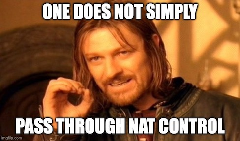

## Introduction

The history of **NAT** ([network address translation](https://en.wikipedia.org/wiki/Network_address_translation)) behaviors on Cisco's ASA firewalls has certainly... *evolved* over the years. In a future blog post, I'll be covering the basics of specific NAT types and how they've changed over different code versions, but today I want to take a quick overview of *default* NAT behavior on Cisco’s firewalls and its evolution.

## NAT Control

Enter **NAT Control**, which over the course of its lifespan went from being a required default, to an optional feature, to ultimately being retired and disabled altogether. Not every firewall engineer may know about the (probably Cisco-specific) concept of NAT control, but like every major change to NAT behavior, it can have a significant effect not just on how traffic flows through the firewall, but also on your mental model of how you might expect a firewall to function.

## Origin

So, what is NAT control, exactly? Beginning with the predecessor to the Cisco ASA, Cisco's **[PIX](https://en.wikipedia.org/wiki/Cisco_PIX)** firewall *required NAT* (or a *NAT exemption*) for *all* traffic passing between any two firewall interfaces, up through the maximum PIX OS version *6.3*.

What this means is that basically an IP packet couldn't pass through the firewall untouched unless a specific NAT exemption was created (essentially, a rule saying “don’t NAT this specific traffic”).

## Evolution

With the introduction of the [Cisco ASA](https://en.wikipedia.org/wiki/Cisco_ASA) in mid-2005, Cisco converted both the PIX and ASA firewalls to the newer *ASA codebase* starting with version *7.0(1)*. In that version, the **nat-control** feature became available so that the previous default PIX NAT behavior could be enabled or disabled, which is as simple as issuing the commands *"nat-control"* or *"no nat-control"*.

Once *disabled*, there doesn't need to be any NAT configuration in place for traffic to pass between the firewall's interfaces, as long as existing access-lists, security-levels, and routing entries permit that traffic to do so. Granted, if you're considering the common scenario of an internet-edge facing firewall that NATs [private IPv4 space](https://en.wikipedia.org/wiki/Private_network) to one or more public IPv4 addresses, you'll still need to NAT anyway (or move to [IPv6](https://en.wikipedia.org/wiki/IPv6) already!).

## Displacement

By the time Cisco did the massive NAT reboot of the ASA 8.3 code train around mid-2010, **nat-control** was no more. Release version *8.3(1)* marked the end of the availability of the **nat-control** feature, no longer even available as a configurable option.

Nowadays, if no NAT rules have been put in place, packets can traverse Cisco firewalls with their source and destination IP addresses blissfully unchanged (and besides, who wouldn't like to save a few CPU cycles on their firewall if we can get away with it?).

