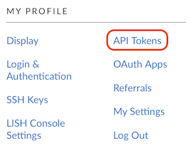
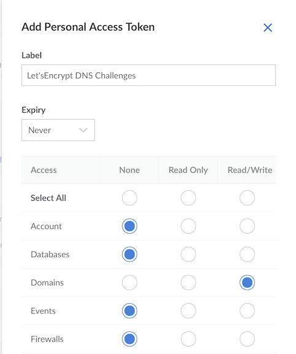
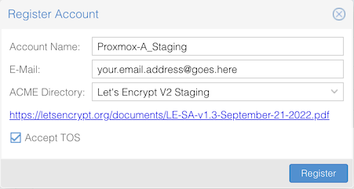
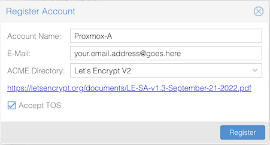
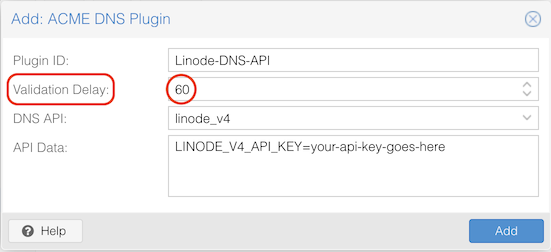
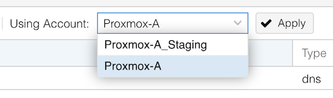
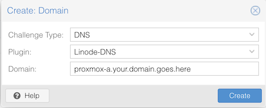
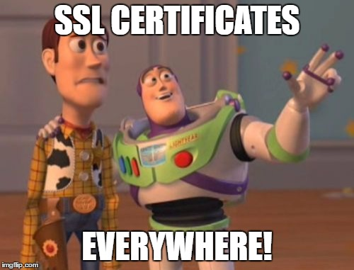

If you're a fan of **Proxmox Virtualization Environment** (PVE) like I am, you'll also likely be a fan of the fact that your Proxmox VE server(s) can utilize a **free** service called **[Let'sEncrypt](https://letsencrypt.org)** to acquire a valid SSL certificate.

Let'sEncrypt works by first making you verify ownership of a domain or server, typically using either an HTTP connection to the server, or through a specific DNS record lookup. Once you've proven ownership, a certificate is automatically generated and downloaded (and optionally auto-installed on the server) to provide a "valid" TLS connection between your web browser and the server.

This is much preferable to the default self-signed certificates that come installed "out-of-the-box," generating security warnings and generally make it slightly less pleasant to administer your Proxmox box.

In this example, since I'm a fan of **[Linode](https://linode.com)** and their hosting services, and because their DNS service is supported as a plugin by **certbot** (a command-line tool for interacting with Let'sEncrypt), I'll be using Linode DNS for the validation process.

### Creating a Linode API Token

Begin by creating an **API Token** in your Linode account that has permissions to create and delete DNS records.

1. Log into Linode in your web browser
2. Click your profile avatar in upper right -> Click **API Tokens**

\
3. Click **Create Personal Access Token**
\
4. Set name & expiry date (if desired) and change **Domains** to Read/Write

> 📝 Depending on your domain and use-case, it's highly advisable to set the *Default TTL* for your Linode DNS records to something very low (ideally 30 seconds, or 2 minutes), at least while you're setting up Let's Encrypt. Setting the TTL lower helps prevent the ephemeral DNS records used for the DNS challenge from being cached for long periods of time, which can be problematic if a validation fails and you need to try again.

### Configuring Proxmox PVE for ACME / Let's Encrypt

Once you've created a **Linode API Token** (and saved it or wrote it down... *right?*), log into your **Proxmox VE** server's web GUI.

From the left-hand menu, navigate to **Datacenter** -> **ACME**.

Under the **Accounts** section, click **Add**.

1. Create an account for *LetsEncrypt Staging* by creating a descriptive account name and providing your email address.
2. From the **ACME Directory** drop-down menu, select **Let's Encrypt V2 Staging**.
3. Click the box to **Accept TOS** (Terms of Service)
4. Click **Register**
5. Repeat steps 1-4 again, but this time select **Let's Encrypt V2** from the **ACME Directory** drop-down menu.

> 📝 I strongly suggest creating accounts for both Staging and Non-Staging versions of LetsEncrypt. Using the *Staging* version allows you to test the setup without the risk of getting temporarily rate-limited by LetsEncrypt for too many failures in a row. Staging certificates follow the same process as the real certificates, but their root CA is *untrusted* by default in all browsers. Once you get the process working in Staging, switching over to the real Let's Encrypt environment will get you *trusted* certificates.

Under the **Challenge Plugins** section, click **Add**.

1. Create a memorable name, such as *Linode-DNS-API*
2. Change **Validation Delay** from *30 seconds* to (at least) *60 seconds*
3. From the **DNI API** drop-down menu, choose *linode_v4*
4. In the box labeled **API Data**, enter your Linode API Token in the following form:
LINODE_V4_API_KEY=*your-api-key-goes-here*

> 📝 When entering your Linode API token, make sure not to input any quotes or extraneous whitespace.

> 📝 When configuring the DNS plugin, be sure to increase the validation delay from the default 30 seconds. I recommend at least 60 seconds, as Linode's DNS record creation takes significantly longer than 30 seconds. If the validation delay isn't sufficiently long enough to allow for the DNS record's successful creation, the Let's Encrypt DNS validation will never complete successfully.

### Acquiring SSL Certificates from Let's Encrypt

Lastly, back at the left-side Proxmox VE menu, select the *PVE node* that needs an SSL certificate (underneath **Datacenter**).

1. Click on **System** -> **Certificates**
2. Under the **ACME** section, click **Using Account:**, select your *Staging* account and click **Apply**.

\
3. Click thd **Add** button and change **Challenge Type** to *DNS*
\
4. At the **Plugin:** drop-down menu, select the Linode DNS plugin you created above.

\
5. In **Domain:** enter the **hostname** and **domain name** (aka FQDN) you're acquiring a certificate for, then click **Create**.
\
6. Once you've added the new **ACME** entry, click **Order Certificates Now** to run the Let's Encrypt validation challenge.

Assuming everything is set up correctly, you should be able to watch your PVE server run through a DNS challenge, with the temporary TXT verification records being created and deleted automatically through the Linode API. Once complete, your Proxmox VE server will automatically install the new certificate and restart the web GUI.

If you used the *Let's Encrypt V2 Staging* account for the first attempt, you'll still be seeing an invalid SSL certificate error in your browser at this point. Wait a few minutes (you remembered to set the default TTL to a sufficiently low value... *right?*), then run through the above **steps 1-6** again but change the **Account** to the *non-Staging* version.

Once the validation process completes for the **real** Let's Encrypt validation environment and the GUI restarts again, you should be seeing a *valid* SSL certificate on your Proxmox VE now (you may need to close/reopen the browser window). Enjoy!

